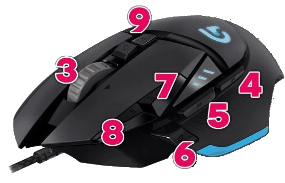
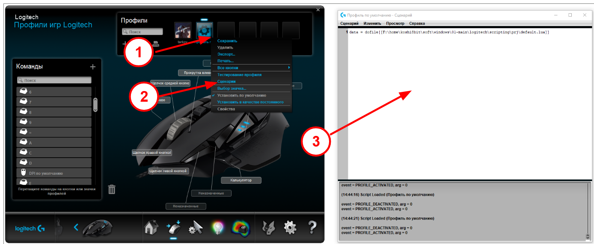
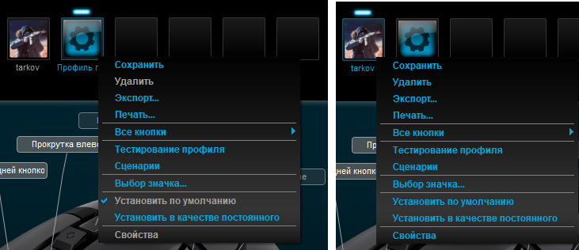

# Examples

Кнопки мыши


Как активировать макрос (возможно если игра запущена из-под админа - надо логитек запускать из под админа тоже)


Разница между галочками в профилях ниже. Профили и скрипты в них переключаются автоматически при смене активного `*.exe`


---

Запуск скрипта из файлов
```lua
data = dofile[[F:\home\koshi8bit\soft\windows\01-main\logitech\scripting\prj\default.lua]]
```
---
Простая покупка в таркове
```lua
local flag

function OnEvent(event, arg)
	OutputLogMessage("event = %s, arg = %s\n", event, arg);
	if (event == "MOUSE_BUTTON_PRESSED" and arg == 4) then
		MoveMouseTo(60951, 8198)
		Sleep(10)
		PressAndReleaseMouseButton(1)
		Sleep(30)
		MoveMouseTo(58748, 11750)
	end

	if (event == "MOUSE_BUTTON_PRESSED" and arg == 8) then
		SetBacklightColor(255, 0, 0);
		PressAndReleaseMouseButton(1)
		Sleep(50)
		PressAndReleaseKey("y")
	end

	if (event == "MOUSE_BUTTON_PRESSED" and arg == 6) then
		SetBacklightColor(0, 255, 0);
		x, y = GetMousePosition();
		OutputLogMessage("Mouse is at %d, %d\n", x, y);
	end
end
```
---
Обработка нажатия с кнопкой CTRL
```lua
 if (event == "G_PRESSED" and arg == 21 and IsModifierPressed("ctrl")) then
  ColorBreathe()
 end
```
---
Циклическая обработка по одной кнопке
```lua
local flag

function OnEvent(event, arg)
    if event == "MOUSE_BUTTON_PRESSED" and arg == 5 then
        flag = not flag
        if flag then
            repeat
            -----------------------
            -- your actions here 
            OutputLogMessage("repeat\n")
            Sleep(1000)
            -----------------------
            Sleep(15)
            local prev_flag = flag
            flag = IsMouseButtonPressed(5)
            until not prev_flag and flag
        end
    end
end

```
---
Прост примеры из гитхаба
- [examples/LGS_script_template.lua](examples/LGS_script_template.lua)